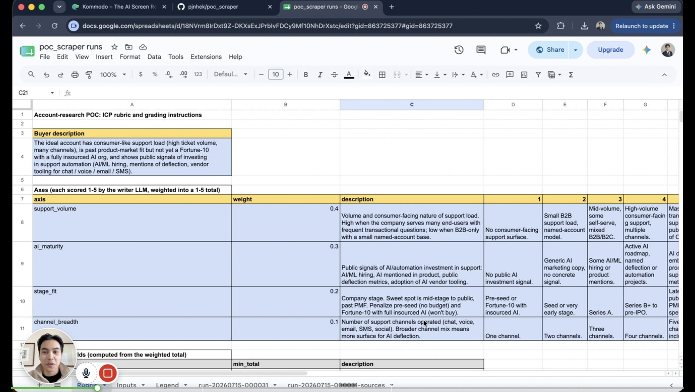
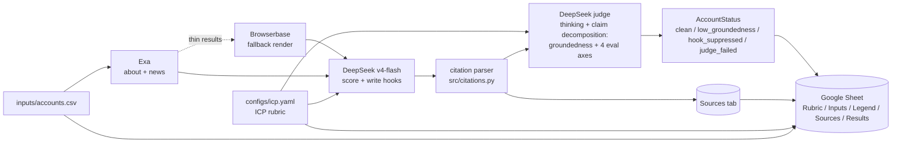

# lead scout

> **POC = Point of Contact**, sales-speak for the right person to reach in an account.
> Also: **Proof of Concept**.

A grounded outreach research pipeline: drop in a CSV of company domains, get back a Google Sheet where every account is scored against an editable ICP, given its top three buyer personas, and handed one personalized outreach hook per persona in which every claim traces to a numbered retrieval.

- **What.** `inputs/accounts.csv` in, scored Google Sheet out. Each row carries an ICP verdict, the weighted per-axis breakdown, three inferred personas, and one outreach paragraph per persona whose hooks and score-justifications hyperlink to numbered evidence in a per-run Sources tab.
- **Why.** Hallucinated context is the most damaging failure in an AI-assisted sales motion. Every claim ties to a numbered retrieval; an unciteable claim is dropped, not shipped, so that failure mode is impossible by construction.
- **Proof.** [2.73 / 5.0 mean groundedness on a 10-record holdout](evals/REPORT.md), judged by `deepseek-v4-flash` with claim-by-claim decomposition. Per-axis means and cross-family kappa live in `evals/REPORT.md`.


*Two of the four AccountStatus states from a real run: clean (white) and low_groundedness (yellow).*

## Demo

[](https://kommodo.ai/recordings/E751BaRaerNaXw78iXEc)

> Recording made at commit [f868a09](https://github.com/pjnhek/poc_scraper/commit/f868a09). README and assets at that SHA match what the video shows.

[Sample output workbook](https://docs.google.com/spreadsheets/d/18NVrm8IrDxt9Z-DKXsExJPrbIvFDCy9Mf10NhDrXstc/edit?usp=sharing): the Rubric, Inputs, Legend, Sources, and Results tabs from a real run.

## What it does



Per run, the workbook gets five tabs:

1. **Rubric**, sourced from `configs/icp.yaml`: buyer description, the four weighted axes with their 1-5 anchors, verdict thresholds, and the LLM-as-judge axes. Rewritten in place each run, so the rubric you read matches the run that produced this Results tab.
2. **Inputs**, the contents of `inputs/accounts.csv` with a load timestamp and count.
3. **Legend**, the AccountStatus palette: one row per state with its color swatch and a one-line definition.
4. **Sources: `run-YYYYMMDD-HHMMSS`**, one row per numbered retrieval used by the writer and the judge, paired with the Results tab. Every hook cell and score-justification cell is a `=HYPERLINK` that jumps to that account's first evidence row.
5. **Results: `run-YYYYMMDD-HHMMSS`**, one row per account: firmographics, ICP verdict with per-axis score columns, top-three personas, one grounded outreach paragraph per persona, and judge scores.

Row color is the account's **AccountStatus**: `clean` (white) when every atomic claim traces to a retrieval, `low_groundedness` (yellow) when the judge flags groundedness below the configured threshold, `hook_suppressed` (orange) when no outreach content shipped (the account could not be enriched, scored, or given personas, or every hook failed citation coverage), and `judge_failed` (gray) when the judge returned empty or errored.

### Failure-mode gallery

Cropped from real runs. `hook_suppressed` and `judge_failed` are defined above but did not surface across the real-run attempts used for these captures.

#### clean (white)


*All atomic claims trace to a numbered retrieval; row stays white.*

#### low_groundedness (yellow)


*Judge flagged groundedness below the configured threshold; row tinted yellow, eval_groundedness cell in red text.*

Citations run on numbered justifications: each Exa retrieval (about page plus recent news) gets a 1-based index, and the writer emits every claim with its own `cited_indices`. A rapidfuzz coverage check in `src/citations.py` drops any claim that does not match its cited evidence before assembly, so an unciteable assertion never reaches the sheet. The judge then re-decomposes the shipped paragraph and scores groundedness deterministically as `(cited / max(total, 3)) * 5`, which penalizes short hooks that cite once and stop.

## What this gets wrong

- **Cross-family judge agreement is modest.** Inter-judge kappa between `deepseek-v4-flash` and the cross-family judge `moonshot-v1-32k` is 0.176 on groundedness with 16.7% exact agreement, which is "slight" agreement on the Landis-Koch scale; see [evals/REPORT.md](evals/REPORT.md) §5. A same-family judge shares blind spots with the writer, and the cross-family number is the honest bound on what the eval can detect.
- **Persona inference is heuristic.** The top-three personas come from firmographic and about-page LLM inference, not a contact-discovery API like Apollo or Clearbit. "POC = Point of Contact" is the weakest claim in the project name; treat the personas as research leads, not a sourced contact list.
- **Single-source retrieval.** Exa primary plus Browserbase fallback, no vector store, no multi-source ensemble. A claim that needs synthesizing across multiple retrievals will not benefit from cross-document reasoning the pipeline does not perform.

## Stack

- **DeepSeek** (OpenAI-compatible) for synthesis. Writer = `deepseek-v4-flash` in non-thinking mode; judge = `deepseek-v4-flash` with thinking on and `reasoning_effort=medium`, which separates writer from judge on the same base model. Set `JUDGE_MODEL_DEEPSEEK=deepseek-v4-pro` to widen the gap. Roughly $0.20-0.40 per 10-domain run; context caching is automatic (repeat retrievals hit the cache at 1/10 input price).
- **NVIDIA Build** as a free fallback (`LLM_PROVIDER=nvidia`, or leave `DEEPSEEK_API_KEY` empty). Preview models with rate limits and connection drops; fine for offline development, unreliable for live demos.
- **Exa** for neural search over about pages and last-90-day news; **Browserbase** for JS-rendered fallback when Exa misses.
- **LLM-as-judge** scoring groundedness plus icp_relevance, personalization, specificity, and recency on a 1-5 categorical scale ([1-10 numeric judges drift](https://docs.nvidia.com/nemo/microservices/latest/evaluator/metrics/llm-as-a-judge.html)).
- **Google Sheets** as the output surface so a non-technical reader can act on it.

Keep the writer and judge in different model classes or thinking modes; same model with the same settings means self-grading bias.

## ICP rubric

Configured in `configs/icp.yaml`. Default weights:

- 40% **Support volume** - consumer-facing or transaction-heavy, public reviews of support load.
- 30% **AI/automation maturity** - AI/ML hiring, AI mentioned in product, public deflection metrics.
- 20% **Stage fit** - mid-stage to public, not pre-seed, not Fortune 10 with full insourced AI.
- 10% **Channel breadth** - chat plus voice plus email plus SMS support exists.

Each axis is scored 1-5 by the writer using the anchor descriptions in the YAML, then weighted into a 1-5 total. Verdict bucketing: total >= 4.0 = strong, >= 2.5 = borderline, < 2.5 = weak. Edit `configs/icp.yaml` to retarget for a different vertical; both the scoring prompt and the judge prompt read from this file, so they stay in sync.

## What's next

- v2: feedback loop. When a user rejects a recommendation, the rubric weights update.
- v3: CRM trigger. Runs automatically when a new account hits the CRM.

## Run it

```bash
# 1. Install
make install

# 2. Add API keys to .env (copy from .env.example)
cp .env.example .env
# fill in DEEPSEEK_API_KEY (recommended) OR NVIDIA_API_KEY (free fallback),
# plus EXA_API_KEY, BROWSERBASE_API_KEY, BROWSERBASE_PROJECT_ID.
# point GOOGLE_APPLICATION_CREDENTIALS at a Sheets-enabled service-account JSON

# 3. Drop domains into inputs/accounts.csv (one per line, header `domain`)

# 4. Ship
make run
```

`make run` runs the full pipeline against `inputs/accounts.csv` and writes the workbook. To cap how many domains a run processes (useful for demos and rate limits), set `RUN_LIMIT`:

```bash
RUN_LIMIT=5 make run     # process first 5 domains from accounts.csv
```

`.env.example` documents every variable, including writer/judge model overrides, reasoning settings, and the optional local `.secrets-denylist` that arms the public-repo guard (`make verify-public-repo`).

## Eval

- `make eval` runs the full pipeline (real Exa, writer, Browserbase) against the first 3 domains in `inputs/accounts.csv`, then has the judge score every generated paragraph. Output is a per-domain, per-persona markdown table. Override with `EVAL_LIVE_DOMAINS=foo.com,bar.com` or `EVAL_LIVE_LIMIT=5`.
- `make eval-fixtures` runs the judge against `evals/labeled.jsonl` (hand-labeled paragraphs). This is a calibration check on the judge model, not a pipeline check; useful when you swap judge models. See [evals/REPORT.md](evals/REPORT.md) for the full rigor narrative.

## Tests

| Layer       | What it covers                                                            | Hits real APIs? |
|-------------|---------------------------------------------------------------------------|-----------------|
| unit        | Pure functions (rubric math, citation extraction, CSV parsing).           | No              |
| functional  | One module with stubbed external boundaries.                              | No              |
| integration | Multiple modules wired with stubbed external boundaries.                  | No              |
| smoke       | Real LLM + Exa + Browserbase + Sheets, 2-3 fixture domains.               | Yes (opt-in)    |
| edge cases  | Empty enrichment, scrape blocked, sub-threshold eval, rate limits.        | Mixed           |

`make test` runs everything except smoke. `make smoke` runs the live E2E.
