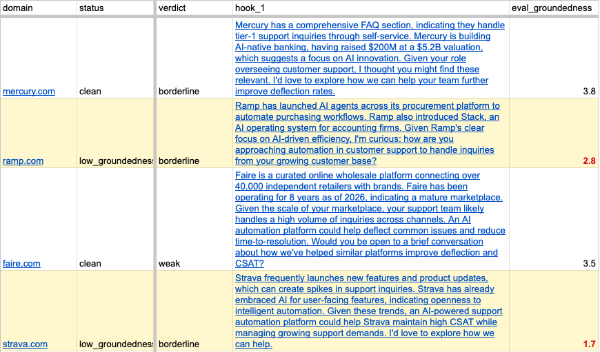
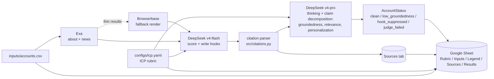
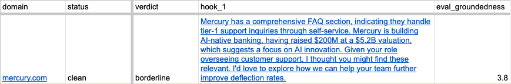
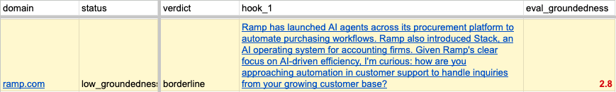

# lead scout

> **POC = Point of Contact**, sales-speak for the right person to reach in an account.
> Also: **Proof of Concept**.

A grounded outreach research pipeline. Drop a CSV of company domains in, get back a Google Sheet with an ICP fit score, the top three buyer personas to reach, and a personalized outreach hook per persona where every claim traces to a numbered retrieval.

- **What.** `inputs/accounts.csv` in, scored Google Sheet out. Each row carries an ICP verdict, weighted axis breakdown, three inferred personas, and one outreach paragraph per persona where each hook and score-justification cell hyperlinks to the numbered evidence in a per-run Sources tab.
- **Why.** Grounded outreach. Every claim ties to a numbered retrieval; an unciteable claim gets dropped, not shipped. Hallucinated context is the most damaging failure in an AI-assisted sales motion, so the pipeline is built around making that failure mode impossible by construction.
- **Proof.** [2.73 / 5.0 mean groundedness on a 10-record holdout](evals/REPORT.md), judged by `deepseek-v4-flash` with claim-by-claim decomposition. The full rigor narrative, per-axis means, and cross-family kappa numbers live in `evals/REPORT.md`.



*A row band cropped from a real run against mercury.com, ramp.com, faire.com, and strava.com, showing two of the four AccountStatus states side by side: clean (white) and low_groundedness (yellow). The full four-state palette is documented in the gallery below and mirrored in the workbook's Legend tab.*

The ICP rubric, weights, and definition live in `configs/icp.yaml` so the same code can be retargeted at any vertical without touching prompts.

## Demo

[](https://www.loom.com/share/e089ab6b686043d9b612963a96454cf2)

<!-- SHA-PIN: Loom + commit SHA block goes here; populated in Plan 04 per D-08 -->

[Sample output workbook](https://docs.google.com/spreadsheets/d/18NVrm8IrDxt9Z-DKXsExJPrbIvFDCy9Mf10NhDrXstc/edit?usp=sharing), the Rubric, Inputs, Legend, Sources, and Results tabs from a real run.

## What it does



Per run, the workbook gets five tabs:

1. **Rubric**, buyer description, the four weighted axes with their 1-5 anchor descriptions, verdict thresholds, and the LLM-as-judge axes. Sourced from `configs/icp.yaml`. Rewritten in place each run so the rubric you read always matches the rubric that produced this run's Results.
2. **Inputs**, the contents of `inputs/accounts.csv`, with a load timestamp and count. Rewritten in place each run.
3. **Legend**, the in-sheet mirror of the AccountStatus palette. One row per state with its color swatch and a one-line definition, so a reader does not have to leave the workbook to decode a row's color.
4. **Sources: `run-YYYYMMDD-HHMMSS`**, one row per numbered retrieval used by the writer and the judge. New tab on every run, paired with the Results tab. Each hook cell and each score-justification cell is wrapped end-to-end as a `=HYPERLINK` formula (per `_hyperlink_formula` in `src/sheets.py`) that jumps to that account's first evidence row in this tab.
5. **Results: `run-YYYYMMDD-HHMMSS`**, one row per account, with firmographics, ICP fit verdict with weighted per-axis score columns, top-three personas, one grounded outreach paragraph per persona, and judge scores. The per-axis columns expose the underlying weighted total directly so a reader can audit how a verdict was assembled.

Row colors signal the **AccountStatus** of the row: `clean` (white) when every atomic claim traces to a retrieval, `low_groundedness` (yellow) when the judge flags groundedness below the configured threshold, `hook_suppressed` (orange) when the writer emitted unciteable claims and the outreach paragraph was suppressed, and `judge_failed` (gray) when the judge returned empty or errored. The Legend tab inside the workbook carries the same palette so a reader can decode a row's color without leaving the sheet.

### Failure-mode gallery

Gallery rows are cropped from real runs, not necessarily the same run as the Loom. Two of the four AccountStatus states are pictured below; `hook_suppressed` and `judge_failed` are described in the prose above but did not surface across the three real-run attempts used for these captures.

#### clean (white)



*All atomic claims trace to a numbered retrieval; row stays white.*

#### low_groundedness (yellow)



*Judge flagged groundedness below the configured threshold; row tinted yellow, eval_groundedness cell in red text.*

Citations work via numbered justifications. Each Exa retrieval (about page plus recent news) gets a 1-based index. The writer emits each claim as a structured object with its own `cited_indices` array (per claim, not inline in the prose). A rapidfuzz coverage check in `src/citations.py` compares the claim text to the cited evidence summary, and any claim that fails the configured threshold is dropped entirely before assembly so an unciteable assertion never reaches the sheet. The judge then decomposes the surviving paragraph back into atomic claims and marks each as supported by an index or `uncited`. Groundedness is computed deterministically: `(cited / max(total, 3)) * 5`, which penalizes short hooks that drop one citation and stop. In the workbook, the whole hook cell and the whole score-justification cell are wrapped as a `=HYPERLINK` formula in `src/sheets.py` that jumps to that account's first row in the run's Sources tab; clicking anywhere in the cell lands on the indexed evidence rows.

Demo flow: open the workbook, scroll the Rubric tab to explain the grading approach, scroll the Inputs tab to show what was researched, open the Legend tab to read the AccountStatus palette, then open the latest Results tab to walk through verdicts and outreach drafts, clicking a hook or score-justification cell to jump into the Sources tab, and finishing on the `evals/REPORT.md` link for the rigor narrative.

## What this gets wrong

- **Cross-family judge agreement is modest.** Inter-judge kappa between `deepseek-v4-flash` and `bytedance/seed-oss-36b-instruct` is 0.176 on groundedness with 16.7% exact agreement; see [evals/REPORT.md](evals/REPORT.md) §5 for the full table. A same-family judge shares blind spots with the writer, and the cross-family number is the honest bound on what the eval can detect.
- **Persona inference is heuristic.** The top-three personas come from firmographic and about-page LLM inference, not a contact-discovery API like Apollo or Clearbit. "POC = Point of Contact" is the weakest claim in the project name; treat the personas as research leads, not a sourced contact list.
- **Single-source retrieval.** Exa primary plus Browserbase fallback, no vector store, no multi-source ensemble. A claim that needs synthesizing across multiple retrievals will not benefit from cross-document reasoning the pipeline does not perform.

## Stack and design choices

- **DeepSeek API** ([https://api.deepseek.com](https://api.deepseek.com)) for synthesis. OpenAI-compatible. Default writer = `deepseek-v4-flash` in non-thinking mode, judge = `deepseek-v4-pro` with `thinking={"type":"enabled"}` and `reasoning_effort="high"`. Two different model sizes plus thinking-on/off for the judge gives meaningful separation from the writer. ~$0.20-0.40 per 10-domain run during the v4-pro discount window.
- **NVIDIA Build endpoint** ([https://build.nvidia.com/](https://build.nvidia.com/)) is supported as a free fallback (set `LLM_PROVIDER=nvidia` or just leave `DEEPSEEK_API_KEY` empty). Free preview models with rate limits and connection drops; usable for offline development but unreliable for live demos.
- **Context caching is automatic on DeepSeek.** Repeated retrievals (the same numbered justifications across writer score / contacts / outreach calls) hit the disk cache at 1/10 the input price. No code change needed; `usage.prompt_cache_hit_tokens` in responses confirms hits when you want to verify.
- **Exa** for neural search on about pages and last-90-day company news.
- **Browserbase** for JS-rendered fallback when Exa misses.
- **LLM-as-judge eval** scoring groundedness, ICP relevance, and personalization on a 1-5 categorical scale (per [NeMo guidance](https://docs.nvidia.com/nemo/microservices/latest/evaluator/metrics/llm-as-a-judge.html), 1-10 numeric judges drift).
- **Google Sheets** as the output surface so a non-technical reader can act on it.

## ICP rubric

The rubric is configured in `configs/icp.yaml`. Default weights:

- 40% **Support volume** - consumer-facing or transaction-heavy, public reviews of support load.
- 30% **AI/automation maturity** - AI/ML hiring, AI mentioned in product, public deflection metrics.
- 20% **Stage fit** - mid-stage to public, not pre-seed, not Fortune 10 with full insourced AI.
- 10% **Channel breadth** - chat plus voice plus email plus SMS support exists.

Each axis is scored 1-5 by the writer using anchor descriptions in the YAML, then weighted into a 1-5 total. Verdict bucketing: total >= 4.0 = strong, >= 2.5 = borderline, < 2.5 = weak.

Edit `configs/icp.yaml` to retarget for a different vertical. Both the scoring prompt and the judge prompt read from this file, so they stay in sync.

## What's next

- v2: feedback loop. When a user rejects a recommendation, the rubric weights update.
- v3: CRM trigger. Runs automatically when a new account hits the CRM.

## Run it

```bash
# 1. Install
make install

# 2. Add API keys to .env (copy from .env.example)
cp .env.example .env
# fill in DEEPSEEK_API_KEY (recommended) OR NVIDIA_API_KEY (free fallback),
# plus EXA_API_KEY, BROWSERBASE_API_KEY, BROWSERBASE_PROJECT_ID.
# point GOOGLE_APPLICATION_CREDENTIALS at a Sheets-enabled service-account JSON

# 3. Drop domains into inputs/accounts.csv (one per line, header `domain`)

# 4. Ship
make run
```

`make run` runs the full pipeline against `inputs/accounts.csv` and writes the workbook. `make smoke` is a separate target you can run when you want to verify against a fixed pair of fixture domains; it's intentionally not chained to `make run` because both hit the same NVIDIA free-tier endpoint and stacking them invites rate limiting.

To cap how many domains a single run processes (useful for demos and to avoid rate limits), set `RUN_LIMIT`:

```bash
RUN_LIMIT=5 make run     # process first 5 domains from accounts.csv
```

### Local setup

If you want the public-repo guard active locally (recommended for any contributor pushing to the public repo), create `.secrets-denylist` at the repo root. The file is gitignored by design so the sensitive terms never enter version control. Add one regex per line (lines beginning with `#` are comments). Both the pre-commit hook (`scripts/check_public_discipline.py`) and the verification script (`make verify-public-repo`) read from this file. Without `.secrets-denylist`, the pre-commit hook is silent by design (so a fresh clone can commit), but `make verify-public-repo` exits non-zero with a setup prompt.

### Picking models

**DeepSeek (recommended).** Defaults: writer = `deepseek-v4-flash`, judge = `deepseek-v4-pro` with thinking and `reasoning_effort=high`. Override via `WRITER_MODEL_DEEPSEEK` and `JUDGE_MODEL_DEEPSEEK` in `.env`. Use `JUDGE_REASONING_EFFORT_DEEPSEEK` (`low`/`medium`/`high`) to dial reasoning intensity.

**NVIDIA Build (fallback).** Defaults: writer = `minimaxai/minimax-m2.7`, judge = `bytedance/seed-oss-36b-instruct`. NVIDIA's preview model availability rotates, so if you see a 400 / "DEGRADED function" error, swap via `WRITER_MODEL_NVIDIA` or `JUDGE_MODEL_NVIDIA`. Tested working alternatives:

- Writer: `mistralai/mistral-large-3-675b-instruct-2512`, `qwen/qwen3-coder-480b-a35b-instruct`
- Judge: `qwen/qwen3-coder-480b-a35b-instruct`, `nvidia/nemotron-mini-4b-instruct`

Keep the writer and judge in different model classes. Same model with the same settings means self-grading bias.

### Reasoning settings

**On DeepSeek** the judge runs in thinking mode (`extra_body={"thinking": {"type":"enabled"}}`) with `reasoning_effort="high"`. Both fields are sent automatically by `_build_judge`; tune via `JUDGE_REASONING_EFFORT_DEEPSEEK`. The writer stays in non-thinking mode for speed.

**On NVIDIA** reasoning models (like Seed-OSS) use a separate `thinking_budget` extra. The default is `JUDGE_REASONING_BUDGET=0` (disabled) because long reasoning calls regularly time out on the free-tier endpoint. Set to `1024` for bounded reasoning or `-1` for unlimited (and bump `JUDGE_MAX_TOKENS` to 8192+ to leave room for the JSON output).

## Eval

Two modes:

- `make eval` (alias for `make eval-live`) runs the **full pipeline** (real Exa, real writer, real Browserbase) against the first 3 domains in `inputs/accounts.csv`, then has the judge score every generated outreach paragraph. Output is a per-domain, per-persona markdown table. This is what a demo wants. Override domains with `EVAL_LIVE_DOMAINS=foo.com,bar.com make eval-live` or count with `EVAL_LIVE_LIMIT=5`.
- `make eval-fixtures` runs the judge against `evals/labeled.jsonl` (hand-labeled synthetic paragraphs). This is a calibration check on the judge model, not a pipeline check. Useful when you swap judge models and want to confirm the new judge agrees with prior labels.

Headline rigor number: [2.73 / 5.0 mean groundedness on a 10-record holdout](evals/REPORT.md), judged by `deepseek-v4-flash` with claim-by-claim decomposition. See `evals/REPORT.md` for the full narrative including per-axis means and cross-family calibration.

## Tests

| Layer       | What it covers                                                            | Hits real APIs? |
|-------------|---------------------------------------------------------------------------|-----------------|
| unit        | Our pure functions (rubric math, citation extraction, CSV parsing).       | No              |
| functional  | One module with stubbed external boundaries.                              | No              |
| integration | Multiple modules wired with stubbed external boundaries.                  | No              |
| smoke       | Real LLM + Exa + Browserbase + Sheets, 2-3 fixture domains.               | Yes (opt-in)    |
| edge cases  | Empty enrichment, scrape blocked, sub-threshold eval, rate limits.        | Mixed           |

`make test` runs everything except smoke. `make smoke` runs the live E2E.
