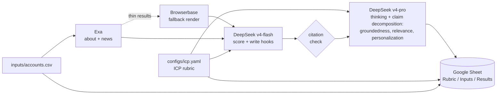

# lead scout

> **POC = Point of Contact**, sales-speak for the right person to reach in an account.
> Also: **Proof of Concept**.

A generic account-research prototype. Given a CSV of company domains, it produces a scored Google Sheet with the top 3 buyer personas to reach and a personalized outreach hook per persona, grounded in retrieved company context with inline citations.

The ICP rubric, weights, and definition live in `configs/icp.yaml` so the same code can be retargeted at any vertical without touching prompts.

## Demo

[](https://www.loom.com/share/e089ab6b686043d9b612963a96454cf2)

## What it does



Per run, the workbook gets three tabs:

1. **Rubric** — buyer description, the 4 weighted axes with their 1-5 anchor descriptions, verdict thresholds, and the LLM-as-judge axes. Sourced from `configs/icp.yaml`. Rewritten in place each run so the rubric you're reading always matches the rubric that produced this run's Results.
2. **Inputs** — the contents of `inputs/accounts.csv`, with a load timestamp and count. Rewritten in place each run.
3. **Results: `run-YYYYMMDD-HHMMSS`** — one row per account. New tab on every run, so the workbook accumulates a history. Per row: firmographics, ICP fit verdict (strong / borderline / weak) with weighted breakdown, top-3 personas, one grounded outreach paragraph per persona using `[N]` markers tied to numbered justifications, and judge scores.

Row colors signal the **verdict only**: strong = green, borderline = yellow, weak = pink. When the judge flags a row's groundedness below the threshold, the `eval_groundedness` cell turns red text — the row keeps its verdict color so you can read fit and quality independently.

Citations work via numbered justifications. Each Exa retrieval (about page + recent news) gets a 1-based index. The writer references those indices inline (e.g. "their recent AI push [2]"). The judge decomposes each paragraph into atomic claims and marks each claim as supported by an index or 'uncited'. Groundedness is computed deterministically: `(cited / max(total, 3)) * 5`, which penalizes short hooks that drop one citation and stop.

Demo flow: open the workbook, scroll the Rubric tab to explain the grading approach, scroll the Inputs tab to show what was researched, then open the latest Results tab to walk through verdicts, numbered citations, and outreach drafts.

## Stack and design choices

- **DeepSeek API** ([https://api.deepseek.com](https://api.deepseek.com)) for synthesis. OpenAI-compatible. Default writer = `deepseek-v4-flash` in non-thinking mode, judge = `deepseek-v4-pro` with `thinking={"type":"enabled"}` and `reasoning_effort="high"`. Two different model sizes plus thinking-on/off for the judge gives meaningful separation from the writer. ~$0.20-0.40 per 10-domain run during the v4-pro discount window.
- **NVIDIA Build endpoint** ([https://build.nvidia.com/](https://build.nvidia.com/)) is supported as a free fallback (set `LLM_PROVIDER=nvidia` or just leave `DEEPSEEK_API_KEY` empty). Free preview models with rate limits and connection drops; usable for offline development but unreliable for live demos.
- **Context caching is automatic on DeepSeek.** Repeated retrievals (the same numbered justifications across writer score / contacts / outreach calls) hit the disk cache at 1/10 the input price. No code change needed; `usage.prompt_cache_hit_tokens` in responses confirms hits when you want to verify.
- **Exa** for neural search on about pages and last-90-day company news.
- **Browserbase** for JS-rendered fallback when Exa misses.
- **LLM-as-judge eval** scoring groundedness, ICP relevance, and personalization on a 1-5 categorical scale (per [NeMo guidance](https://docs.nvidia.com/nemo/microservices/latest/evaluator/metrics/llm-as-a-judge.html), 1-10 numeric judges drift).
- **Google Sheets** as the output surface so a non-technical reader can act on it.

## ICP rubric

The rubric is configured in `configs/icp.yaml`. Default weights:

- 40% **Support volume** - consumer-facing or transaction-heavy, public reviews of support load.
- 30% **AI/automation maturity** - AI/ML hiring, AI mentioned in product, public deflection metrics.
- 20% **Stage fit** - mid-stage to public, not pre-seed, not Fortune 10 with full insourced AI.
- 10% **Channel breadth** - chat plus voice plus email plus SMS support exists.

Each axis is scored 1-5 by the writer using anchor descriptions in the YAML, then weighted into a 1-5 total. Verdict bucketing: total >= 4.0 = strong, >= 2.5 = borderline, < 2.5 = weak.

Edit `configs/icp.yaml` to retarget for a different vertical. Both the scoring prompt and the judge prompt read from this file, so they stay in sync.

## What's next

- v2: feedback loop. When a user rejects a recommendation, the rubric weights update.
- v3: CRM trigger. Runs automatically when a new account hits the CRM.

## Run it

```bash
# 1. Install
make install

# 2. Add API keys to .env (copy from .env.example)
cp .env.example .env
# fill in DEEPSEEK_API_KEY (recommended) OR NVIDIA_API_KEY (free fallback),
# plus EXA_API_KEY, BROWSERBASE_API_KEY, BROWSERBASE_PROJECT_ID.
# point GOOGLE_APPLICATION_CREDENTIALS at a Sheets-enabled service-account JSON

# 3. Drop domains into inputs/accounts.csv (one per line, header `domain`)

# 4. Ship
make run
```

`make run` runs the full pipeline against `inputs/accounts.csv` and writes the workbook. `make smoke` is a separate target you can run when you want to verify against a fixed pair of fixture domains; it's intentionally not chained to `make run` because both hit the same NVIDIA free-tier endpoint and stacking them invites rate limiting.

To cap how many domains a single run processes (useful for demos and to avoid rate limits), set `RUN_LIMIT`:

```bash
RUN_LIMIT=5 make run     # process first 5 domains from accounts.csv
```

### Picking models

**DeepSeek (recommended).** Defaults: writer = `deepseek-v4-flash`, judge = `deepseek-v4-pro` with thinking and `reasoning_effort=high`. Override via `WRITER_MODEL_DEEPSEEK` and `JUDGE_MODEL_DEEPSEEK` in `.env`. Use `JUDGE_REASONING_EFFORT_DEEPSEEK` (`low`/`medium`/`high`) to dial reasoning intensity.

**NVIDIA Build (fallback).** Defaults: writer = `minimaxai/minimax-m2.7`, judge = `bytedance/seed-oss-36b-instruct`. NVIDIA's preview model availability rotates — if you see a 400 / "DEGRADED function" error, swap via `WRITER_MODEL_NVIDIA` or `JUDGE_MODEL_NVIDIA`. Tested working alternatives:

- Writer: `mistralai/mistral-large-3-675b-instruct-2512`, `qwen/qwen3-coder-480b-a35b-instruct`
- Judge: `qwen/qwen3-coder-480b-a35b-instruct`, `nvidia/nemotron-mini-4b-instruct`

Keep the writer and judge in different model classes. Same model with the same settings means self-grading bias.

### Reasoning settings

**On DeepSeek** the judge runs in thinking mode (`extra_body={"thinking": {"type":"enabled"}}`) with `reasoning_effort="high"`. Both fields are sent automatically by `_build_judge`; tune via `JUDGE_REASONING_EFFORT_DEEPSEEK`. The writer stays in non-thinking mode for speed.

**On NVIDIA** reasoning models (like Seed-OSS) use a separate `thinking_budget` extra. The default is `JUDGE_REASONING_BUDGET=0` (disabled) because long reasoning calls regularly time out on the free-tier endpoint. Set to `1024` for bounded reasoning or `-1` for unlimited (and bump `JUDGE_MAX_TOKENS` to 8192+ to leave room for the JSON output).

## Eval

Two modes:

- `make eval` (alias for `make eval-live`) runs the **full pipeline** (real Exa, real writer, real Browserbase) against the first 3 domains in `inputs/accounts.csv`, then has the judge score every generated outreach paragraph. Output is a per-domain, per-persona markdown table. This is what a demo wants. Override domains with `EVAL_LIVE_DOMAINS=foo.com,bar.com make eval-live` or count with `EVAL_LIVE_LIMIT=5`.
- `make eval-fixtures` runs the judge against `evals/labeled.jsonl` (hand-labeled synthetic paragraphs). This is a calibration check on the judge model, not a pipeline check. Useful when you swap judge models and want to confirm the new judge agrees with prior labels.

```text
(populated after first run)
```

## Tests

| Layer       | What it covers                                                            | Hits real APIs? |
|-------------|---------------------------------------------------------------------------|-----------------|
| unit        | Our pure functions (rubric math, citation extraction, CSV parsing).       | No              |
| functional  | One module with stubbed external boundaries.                              | No              |
| integration | Multiple modules wired with stubbed external boundaries.                  | No              |
| smoke       | Real LLM + Exa + Browserbase + Sheets, 2-3 fixture domains.               | Yes (opt-in)    |
| edge cases  | Empty enrichment, scrape blocked, sub-threshold eval, rate limits.        | Mixed           |

`make test` runs everything except smoke. `make smoke` runs the live E2E.
