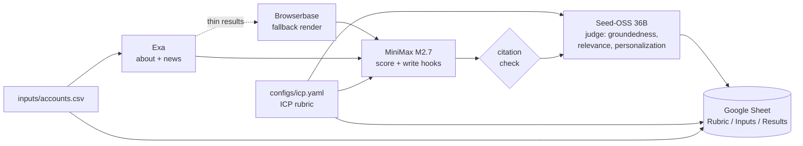

# poc_scraper

> **POC = Point of Contact**, sales-speak for the right person to reach in an account.
> Also: **Proof of Concept**.

A generic account-research prototype. Given a CSV of company domains, it produces a scored Google Sheet with the top 3 buyer personas to reach and a personalized outreach hook per persona, grounded in retrieved company context with inline citations.

The ICP rubric, weights, and definition live in `configs/icp.yaml` so the same code can be retargeted at any vertical without touching prompts.

## What it does



Per run, the workbook gets three tabs:

1. **Rubric** — buyer description, the 4 weighted axes with their 1-5 anchor descriptions, verdict thresholds, and the LLM-as-judge axes. Sourced from `configs/icp.yaml`. Rewritten in place each run so the rubric you're reading always matches the rubric that produced this run's Results.
2. **Inputs** — the contents of `inputs/accounts.csv`, with a load timestamp and count. Rewritten in place each run.
3. **Results: `run-YYYYMMDD-HHMMSS`** — one row per account. New tab on every run, so the workbook accumulates a history. Per row: firmographics, last-90-day context with citations, ICP fit verdict (strong / borderline / weak) with weighted breakdown, top-3 personas, one grounded outreach paragraph per persona, and judge scores.

Rows in Results are color-coded: strong fits get green, borderline get yellow, eval-flagged groundedness gets red (overrides verdict color).

Demo flow: open the workbook, scroll the Rubric tab to explain the grading approach, scroll the Inputs tab to show what was researched, then open the latest Results tab to walk through verdicts, citations, and outreach drafts.

## Stack and design choices

- **NVIDIA Build endpoint** ([https://build.nvidia.com/](https://build.nvidia.com/)) for synthesis. OpenAI-compatible at `https://integrate.api.nvidia.com/v1`, free preview models.
- **Two different model families on purpose**: writer = MiniMax M2.7 (creative, hot temperature). Judge = Seed-OSS 36B (reasoning model, cold temperature, bounded reasoning budget). Splitting them avoids the self-grading bias that shows up when the same model writes and evaluates.
- **Exa** for neural search on about pages and last-90-day company news.
- **Browserbase** for JS-rendered fallback when Exa misses.
- **LLM-as-judge eval** scoring groundedness, ICP relevance, and personalization on a 1-5 categorical scale (per [NeMo guidance](https://docs.nvidia.com/nemo/microservices/latest/evaluator/metrics/llm-as-a-judge.html), 1-10 numeric judges drift).
- **Google Sheets** as the output surface so a non-technical reader can act on it.

## ICP rubric

The rubric is configured in `configs/icp.yaml`. Default weights:

- 40% **Support volume** - consumer-facing or transaction-heavy, public reviews of support load.
- 30% **AI/automation maturity** - AI/ML hiring, AI mentioned in product, public deflection metrics.
- 20% **Stage fit** - mid-stage to public, not pre-seed, not Fortune 10 with full insourced AI.
- 10% **Channel breadth** - chat plus voice plus email plus SMS support exists.

Each axis is scored 1-5 by the writer using anchor descriptions in the YAML, then weighted into a 1-5 total. Verdict bucketing: total >= 4.0 = strong, >= 2.5 = borderline, < 2.5 = weak.

Edit `configs/icp.yaml` to retarget for a different vertical. Both the scoring prompt and the judge prompt read from this file, so they stay in sync.

## What's next

- v2: feedback loop. When a user rejects a recommendation, the rubric weights update.
- v3: CRM trigger. Runs automatically when a new account hits the CRM.

## Run it

```bash
# 1. Install
make install

# 2. Add API keys to .env (copy from .env.example)
cp .env.example .env
# fill in NVIDIA_API_KEY, EXA_API_KEY, BROWSERBASE_API_KEY, BROWSERBASE_PROJECT_ID
# point GOOGLE_APPLICATION_CREDENTIALS at a Sheets-enabled service-account JSON

# 3. Drop domains into inputs/accounts.csv (one per line, header `domain`)

# 4. Ship
make run
```

`make run` runs the full pipeline against `inputs/accounts.csv` and writes the workbook. `make smoke` is a separate target you can run when you want to verify against a fixed pair of fixture domains; it's intentionally not chained to `make run` because both hit the same NVIDIA free-tier endpoint and stacking them invites rate limiting.

### Picking models

The defaults are MiniMax M2.7 (writer) and Seed-OSS 36B (judge). NVIDIA Build's preview model availability rotates, so if you see a 400 / "DEGRADED function" error from one of them, swap via `WRITER_MODEL` or `JUDGE_MODEL` in `.env`. Tested working alternatives at the time of writing:

- Writer: `mistralai/mistral-large-3-675b-instruct-2512`, `qwen/qwen3-coder-480b-a35b-instruct`
- Judge: `qwen/qwen3-coder-480b-a35b-instruct`, `nvidia/nemotron-mini-4b-instruct`, `mistralai/mistral-large-3-675b-instruct-2512`

Keep the writer and judge in different families. Same family means self-grading bias.

### Reasoning budget for the judge

Seed-OSS is a reasoning model. We pass `thinking_budget` via `extra_body` to bound reasoning tokens. `JUDGE_REASONING_BUDGET=1024` leaves room in `JUDGE_MAX_TOKENS=4096` for the final JSON. If you set it to `-1` (unlimited), bump `JUDGE_MAX_TOKENS` to 8192+ or the model will exhaust output budget on reasoning and return an empty paragraph.

For non-reasoning judge models, leave `JUDGE_REASONING_BUDGET=0` to skip the field entirely.

## Eval

Two modes:

- `make eval` (alias for `make eval-live`) runs the **full pipeline** (real Exa, real writer, real Browserbase) against the first 3 domains in `inputs/accounts.csv`, then has the judge score every generated outreach paragraph. Output is a per-domain, per-persona markdown table. This is what a demo wants. Override domains with `EVAL_LIVE_DOMAINS=foo.com,bar.com make eval-live` or count with `EVAL_LIVE_LIMIT=5`.
- `make eval-fixtures` runs the judge against `evals/labeled.jsonl` (hand-labeled synthetic paragraphs). This is a calibration check on the judge model, not a pipeline check. Useful when you swap judge models and want to confirm the new judge agrees with prior labels.

```text
(populated after first run)
```

## Tests

| Layer       | What it covers                                                            | Hits real APIs? |
|-------------|---------------------------------------------------------------------------|-----------------|
| unit        | Our pure functions (rubric math, citation extraction, CSV parsing).       | No              |
| functional  | One module with stubbed external boundaries.                              | No              |
| integration | Multiple modules wired with stubbed external boundaries.                  | No              |
| smoke       | Real LLM + Exa + Browserbase + Sheets, 2-3 fixture domains.               | Yes (opt-in)    |
| edge cases  | Empty enrichment, scrape blocked, sub-threshold eval, rate limits.        | Mixed           |

`make test` runs everything except smoke. `make smoke` runs the live E2E.
